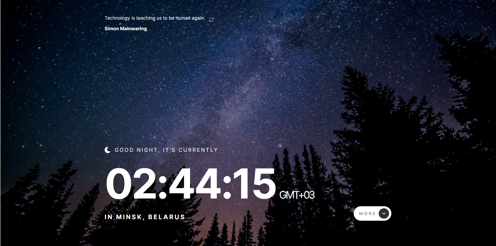

# Frontend Mentor - Clock app solution

This is a solution to the [Clock app challenge on Frontend Mentor](https://www.frontendmentor.io/challenges/clock-app-LMFaxFwrM). Frontend Mentor challenges help you improve your coding skills by building realistic projects.

## Table of contents

- [Overview](#overview)
  - [The challenge](#the-challenge)
  - [Screenshot](#screenshot)
  - [Links](#links)
- [My process](#my-process)
  - [Built with](#built-with)
- [Author](#author)

## Overview

### The challenge

Users should be able to:

- View the optimal layout for the site depending on their device's screen size
- See hover states for all interactive elements on the page
- View the current time and location information based on their IP address
- View additional information about the date and time in the expanded state
- Be shown the correct greeting and background image based on the time of day they're visiting the site
- Generate random programming quotes by clicking the refresh icon near the quote

### Screenshot

### Links

- Solution URL: [Github Repository](https://github.com/simokitkat/clock-app)
- Live Site URL: [Frontend Mentor | Clock App](https://clock-app-islam-soliman.netlify.app)

## My process

### Built with

- [React](https://reactjs.org/) - JS library
- Sass - CSS preprocessor
- [quotable API](https://api.quotable.io/quotes/random) to generate random programming quotes.
- [IP API](https://ipapi.co) to get the user's IP address
- [World Time API](http://worldtimeapi.org/) to set the time based on the visitor's IP adress. This API will also be used for additional data, like the day of the year shown in the expanded state.

## Author

- [Frontend Mentor](https://www.frontendmentor.io/profile/simokitkat)
- [Linkedin](https://www.linkedin.com/in/islamsoliman92)
